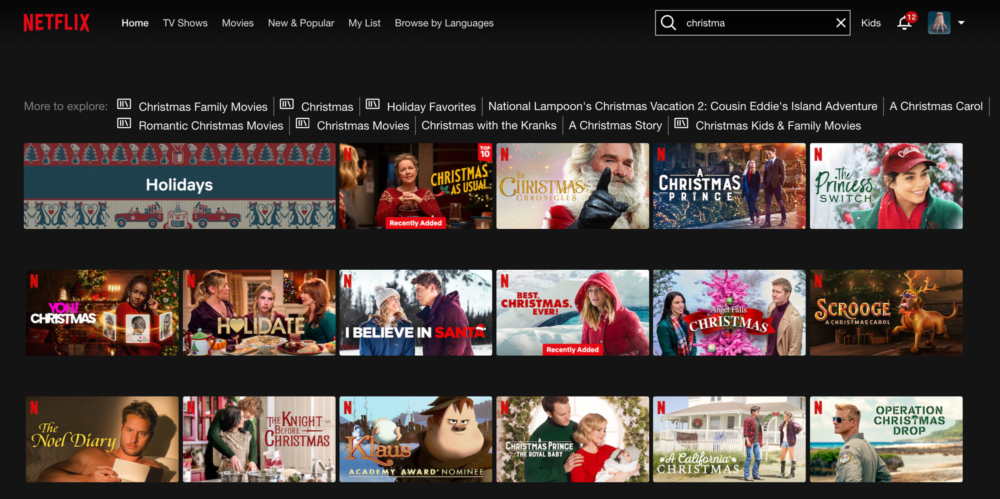

# Programovací adventní výzva ReactGirls

Zakóduj si v adventu a vyhraj některou z hodnotných cen od partnera Lenovo ThinkPad.

- [Úkol](#ukol)
- [Instrukce](#instrukce)

## Úkol č. 2/4
Úkolem je vytvořit jednoduchou aplikaci se dvěma hlavními obrazovkami.

## Instrukce
1. **Obrazovka: vyhledávací:**
    - Toto je výchozí obrazovka aplikace na které je výpis všech filmů (plakát + název filmu).
    - Nahoru přidej pole pro zadávání vyhledávacích dotazů.
    - Vyhledávání se spouští automaticky, když uživatel začne psát do textového pole, bez nutnosti stisknutí vyhledávacího tlačítka (stejně to funguje např. na Netflixu).
    
2. **Obrazovka: detail filmu:**
    - Při kliknutí na film v seznamu se zobrazí detailní informace o tomto filmu.
    - Na této obrazovce by měly být zobrazeny nějaké základní podrobnosti jako název filmu, režie, herecké obsazení atd.
    

**Pokud se nechceš vypisovat s filmy ručně, použij API:**  
    TheMovieDb: https://developers.themoviedb.org/3/getting-started/introduction

(jen je potřeba se tam zaregistrovat a vygenerovat API klíč)

* Své řešení včetně ukázky kódu zašli na e-mail: [reactgirlsprague@gmail.com](mailto:reactgirlsprague@gmail.com)  
    (Doporučujeme využít GitHub a GitHub Pages, ale je to na Tobě, s čím se Ti pracuje dobře)
* Deadline pro odeslání řešení je nejpozději do neděle 17. 12. (včetně).

**Inspirací může být například Netflix nebo HBO**  
      
    